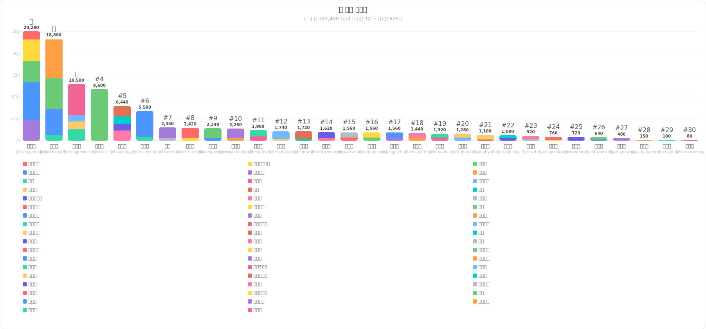
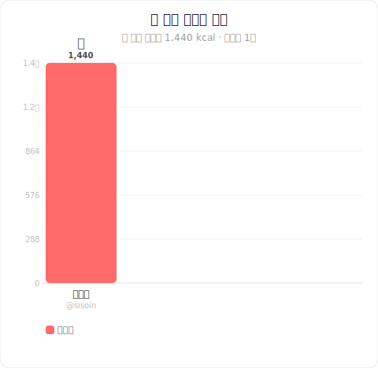
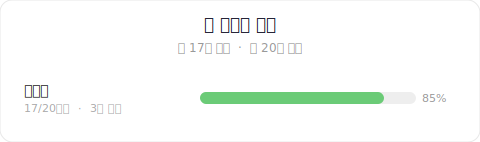

# 🍿 간식 칼로리 기여 현황

> 🍬 총 간식: **20개** &nbsp;|&nbsp; 🔥 총 칼로리: **9,600 kcal** &nbsp;|&nbsp; 👥 참여자: **1명**

> 🎯 🍜 신라면 **19.0**개 분량 &nbsp;|&nbsp; 🍕 피자 한 판(1/8) **12.4**개 분량 &nbsp;|&nbsp; 🍚 공깃밥 **38.4**개 분량 &nbsp;|&nbsp; 🏃 30분 달리기 **32.0**개 분량

## 🏆 랭킹



## 🍽️ 섭취 칼로리 랭킹



## 🏪 탕비실 현황



## 📋 상세 내역

<details>
<summary>🥇 <b>배민준 (@sisoin)</b> — 9,600 kcal 🌟 🍪</summary>


> 다음 업적: ⭐ **간식 러버** — 400 kcal 남음

| 간식 | 수량 | 낱개 구성 | 낱개 칼로리 | 합계 |
|------|-----:|:---------:|------------:|-----:|
| 새우깡 | 20봉지 | 1봉지 (총 20봉지) | 480 kcal/봉지 | **9,600 kcal** |

**섭취한 간식** — 1,440 kcal

| 간식 | 수량 | 칼로리 |
|------|-----:|-------:|
| 새우깡 | 3봉지 | 1,440 kcal |

</details>

## 🙋 참여 방법

1. 이 저장소를 **Fork** 하세요
2. `contributions/` 폴더에 `{본인_GitHub_ID}.txt` 파일을 만드세요
3. 파일에 이름과 기여한 간식, 먹은 간식을 입력하세요:
   ```
   # 이름: 홍길동
   오예스 12개
   초코파이 1박스
   콜라 3캔

   ## 소비
   오예스 2개
   콜라 1캔
   ```
   > `# 이름:` 줄은 선택사항입니다. 없으면 GitHub ID가 표시됩니다.
   > `## 소비` 섹션 이후는 실제로 먹은 간식으로 처리됩니다.
   > 묶음 단위(`1박스`, `2팩` 등)도 자동으로 낱개 수와 칼로리를 계산합니다.
4. **Pull Request** 를 열면 자동으로 칼로리가 계산되어 랭킹에 반영됩니다 🎉

> 파일을 수정해서 PR을 보내면 기존 기여가 대체됩니다.

---
*⚡ Powered by OpenAI · 자동 업데이트*
